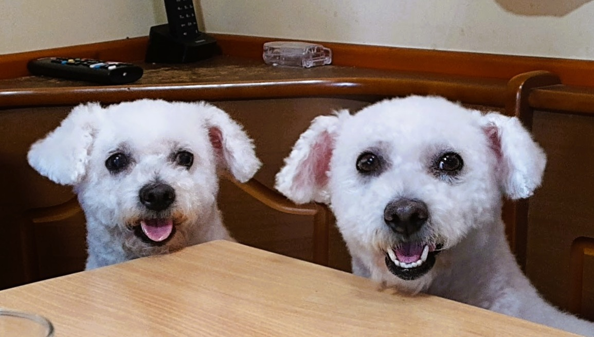

## Datos personales

Empecemos con la parte obligatoria: mi nombre es Nicole Bergamin Gache, tengo 22 años, mi numero de legajo es 203.408-6 y abajo les dejo una foto mia:

## Sobre mi

Bien, sacando eso del medio; soy estudiante de Ing en Sistemas y me encuentro cursando la mayor parte de segundo año (excepto sistemas operativos! Esa ya la cursé 😎). Trabajé casi 4 años en una multinacional como pseudo-IT, y este año decidí renunciar para enfocarme al 100% en la facultad.

Por la parte personal, soy muy de los jueguitos (no controlen mi actividad en discord por favor) y me gusta aprender cosas nuevas. También me gusta mucho la música (toco varios instrumentos) y el deporte (entreno taekwondo, mi segundo amor, hace casi 9 años).

## Expectativas de la materia

Hacia rato que tenia ganas de cursar esta materia ya que tengo algunos proyectos personales de programación en los que me servirian los conocimientos aprendidos. La idea es llevarla al dia e intentar aplicar lo que voy aprendiendo.

## Algo más?

Tengo dos mascotas, Nina (izq.) y Rozy (der.).

Nina cumplió 15 años en enero, y Rozy, su hija, cumple 8 en septiembre ^_^
